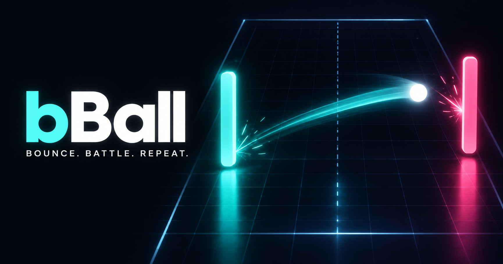

# bBall



A fast, minimal bouncing-ball duel. Drag to move your paddle, keep the ball
alive, and take the points off the bot before it takes them off you.

Built with Vite, React and TypeScript. Gameplay is drawn on a canvas and every
sound is synthesised. The [brand image set](docs/brand-assets.md) supplies the
menu logo, web icons, native launcher icons and cover artwork.

## Getting started

```bash
npm install
npm run dev        # http://localhost:5173
```

| Script                              | What it does                                                |
| ----------------------------------- | ----------------------------------------------------------- |
| `npm run dev`                       | Vite dev server with hot reload                             |
| `npm run build`                     | Type-check the project, then build to `dist/`               |
| `npm run preview`                   | Serve the production build locally                          |
| `npm run typecheck`                 | Type-check without emitting                                 |
| `npm run lint`                      | ESLint over the whole project                               |
| `npm run format`                    | Prettier write                                              |
| `npm run server`                    | The backend, with reload                                    |
| `npm test`                          | Client domain/engine and backend tests                      |
| `npm run desktop`                   | The game in a native window, with hot reload                |
| `npm run icons`                     | Regenerate web and native icons from one mark               |
| `npm run check:bundle`              | Check built menu boundaries and report initial JS/CSS bytes |
| `npm run check:menus`               | Render all lazy menu pages and their pending state in Node  |
| `npm run check:ui`                  | Check mounted menus, dialogs and skill controls in a DOM    |
| `npm run check:experience`          | Check opt-in local capture, boundaries and cleanup          |
| `npm run soak -- …`                 | Run seeded headless matches with stability alerts           |
| `npm run summarize:experience -- …` | Summarize local playtest exports without duplicate trials   |

## Platforms

The same build runs in a browser tab, in a desktop window on Windows, macOS and
Linux, and in a mobile app on Android and iOS. The native shells are
[Tauri](https://tauri.app): a system webview, a Rust binary of a few hundred
kilobytes, and an installer per operating system - no second JavaScript runtime
to ship.

```bash
npm run desktop          # dev, in a native window
npm run desktop:build    # installers for this OS
npm run android          # on a device or emulator
```

Pushing a `v*` tag builds Windows, macOS and Linux installers and attaches them
to a draft release. Two things differ from the web build, both because the shell
serves the game from its own origin: a packaged build needs an absolute
`VITE_API_URL`, and social sign-in returns through the `bball://` URL scheme
rather than a redirect. [docs/packaging.md](docs/packaging.md) covers all of it -
prerequisites, signing, deep links, and what the shell is allowed to do.

## Playing

Default controls:

| Input                                | Action                                                                 |
| ------------------------------------ | ---------------------------------------------------------------------- |
| Drag / move pointer                  | Move your paddle (anywhere on screen - the paddle mirrors your finger) |
| `↑` `↓` or `W` `S`                   | Move your paddle                                                       |
| Tap / `Space` / `Enter`              | Serve immediately instead of waiting, or skip the closing replay       |
| `1`–`9`; `Q` `E` `R` `F` `V` for 1–5 | Use the ability in that slot (or tap the buttons in the corner)        |
| `Esc` or `P`                         | Pause                                                                  |
| `M`                                  | Mute                                                                   |

**Your controls.** Open **Settings → Keyboard controls** to change movement,
both Versus players, serving, pause, mute and all nine skill slots. Each action
can have an alternate key; conflicts are explained before a change is saved.
You can restore the defaults at any time. Escape remains a pause key and
cancels key capture; Tab keeps normal focus navigation. Hints and skill buttons
show your chosen keys. Player 2's movement keys also work in solo play.

Skill buttons activate on the primary mouse press, touch or pen contact, or
keyboard activation. Secondary and auxiliary mouse buttons do not spend a skill.
Cooling buttons stay focusable so their name, shortcut and remaining time can
be read; activation waits until both cooldown and recast lockout have ended.

Touch movement defaults to **Follow finger**. **Settings → Relative drag**
lets you move from a clear spot without jumping the paddle to your finger.
Its **Drag sensitivity** ranges from 50% to 200%. Mouse movement still follows
the pointer directly.

**Flick.** Strike the ball with the outer part of the paddle while the paddle
is already moving that way, and the return leaves a little quicker and much
harder to read. It is the one piece of technique every player has from the
first match - no talent, no button, just the wrist - and a word pops off the
paddle when you land one. Catch a ball on the very tip and the clock slows for
a beat so you can see the save.

**Aimed serve.** When the serve leaves from your end - after you have dropped a
point - your paddle aims it: stand high and it goes high, stand low and it goes
low, and a dashed guide off the ball shows where. It is never flatter than a
gentle angle, so there is no dead-straight gift to be had. The bot's serves
stay a toss-up.

Your paddle is the aqua one (or whatever colour you equip); the bot's is rose.
The labeled score at the top shows each side's points and the winning target;
the dots beside each end mirror those points. The faint number in the
middle of the court is the current rally, and a long enough rally lights up a
streak banner. The ball speeds up with every hit and runs hotter the longer a
rally lasts, so rallies tend to end themselves.

**Learning and pacing.** Open **How to play** from Home for an optional
three-step lesson: move, return, then place an angled return. It uses the real
physics with a slower shot, a paddle-position outline and safe retries. Repeat
or skip it any time, or continue into a Rookie warm-up in Practice. The lesson
awards no XP and records no result. The pause menu also has a controls reference.
Dragging to position the paddle does not skip the serve delay; a short tap,
Space, Enter or the **Serve now** button launches it. In Settings, choose
**Serve pacing → When ready** to wait at each point. Waiting beyond the normal
serve delay holds the court, match timer and skill timers while you aim.
Resuming a paused match shows a short 3–2–1; **Countdown after pause** can turn
it off.

In **Practice**, choose **Normal** or **Relaxed** before selecting a bot.
Relaxed slows the serve, top ball speed and rally acceleration while keeping
your paddle responsive. The choice is remembered on this device and applies
to Practice warm-ups too. Practice awards no XP or saved match progression.

**Match goals.** Journey and Daily show live star-goal counters. Select
**Star goals** to pause and review every goal, its progress and whether it is
still possible. Reaching a rally, flick or return target still requires a win
to earn its star. Score changes have a separate screen-reader announcement;
rally counters do not interrupt it.

**After a loss.** The result card offers one **Next attempt** suggestion from
the match's recorded returns, flicks, rally or objective. It can open the
first-rally lesson or the technique guide; retry stays in the bottom actions.
Missed Challenge goals explain the actual target, including wins that took
too long and rally challenges that do not require a win. Journey and Daily
remind you when a reached target also needs a win in the same match.

**Keeping saved progress.** Giving up a Tournament cup, ending a Gauntlet run
or resetting guest progress opens a confirmation that explains the consequences.
The Keep action receives focus first; Keep, Escape and Back cancel. Ending a
cup or run preserves earned XP and unlocks. Guest reset erases the guest profile
but keeps device settings, and is unavailable during account restoration,
while signed in or in Demo. Replacing the saved cup, run or guest profile,
or entering account restoration or Demo, closes the pending confirmation.

### Modes

| Mode            | What it is                                                             |
| --------------- | ---------------------------------------------------------------------- |
| **Journey**     | Five worlds of six stages, three stars each, seven bosses              |
| **Daily**       | One court a day, the same for everyone, with a forgiving streak        |
| **Gauntlet**    | A roguelite run: nine matches, three hearts, a boon for every win      |
| **Quick Match** | The classic duel, first to five, against any of five bots              |
| **Endless**     | Three lives, one growing rally, a wall that barely misses              |
| **Challenge**   | Eight short matches with a twist: small paddle, portals, 0-2 down…     |
| **Tournament**  | Three rounds against progressively stronger bots, for a trophy         |
| **Versus**      | Two players on one screen - a half each, or separate keyboard controls |
| **Practice**    | Any bot, Normal or Relaxed ball pace, nothing recorded, no XP          |

### Courts and bosses

Some matches are played on a court that is itself a rule: **bumpers** standing
or orbiting in the middle, a **wind** that blows across the court and turns
every few seconds (the chevrons on the touchlines flash the other way just
before it does), a **gravity well** that bends every pass towards the centre,
**brick walls** in front of a goal that break one brick per hit, and
**portals** - linked pairs of mouths that swallow the ball and put it out of
the other at the same speed and heading. Two things keep every court fair. A
force bends the ball but never changes its speed, so the difficulty contract
below still holds; and nothing may turn the ball short of vertical, so no
court can stall a rally. A portal never carries the ball back along the court,
so no pair can loop it forever. The bots read a bending ball the way they read
a bounce, and a portal the way they read a wall - the good ones well, the weak
ones barely. A court added to the daily rotation joins it from a day that has
not started yet, and a Gauntlet run only ever rolls the courts that existed
the day it began, so an update never changes a challenge someone is playing.

A **boss** is a bot brain with a court of its own, a trait, and phases: every
boss changes when you are winning, with a banner that says so. Colossus has a
paddle half again as long; Orbiter spins bumpers round the centre; Tempest
throws the wind about; Bastion hides behind an armoured wall; Singularity is a
gravity well; Trickster's returns bend after you have read them; Apex is all
of it. Each phase can sharpen the brain, change the paddle or strengthen the
court - never slow yours down.

### Journey

Thirty stages in five worlds, each built around one idea and closed by a boss:
the flick, bumpers, a court that bends the ball, walls you have to break, and
all of it at once. Every stage has three stars - the win, and two goals picked
to make you use that world's idea (win by two, keep a clean sheet, hold a long
rally, land flicks, be quick). A stage opens when the one before it is
cleared; a world opens when the last one's boss is down and about sixty per
cent of the stars on offer are banked - never all of them, so one stubborn star
never walls you in. New stars pay XP once, and each world's boss unlocks a
cosmetic.

### Daily

The date rolls a court, a twist and an opponent, the same for everyone that
day. Play it as often as you like; the first clear pays a bonus and moves your
streak. Every seven days of streak banks a freeze (two at most), and a missed
day quietly spends one - a busy evening never throws away a month. A cleared
daily can be shared as a spoiler-free line of stars.

**Copy result** sits below the Daily goals. It reports pending, success or failure;
if automatic copying is unavailable, it offers selectable text for manual copying
and a retry. Copying changes no progress, and Play stays pinned below the scrolling
content. Duplicate presses during a pending copy do not start another write.

Home's Daily tile and the Daily preview refresh at local midnight and on returning
to the page. Home updates the challenge title, cleared stars and displayed streak
without moving focus. A 30-second foreground check also picks up clock changes;
calendar polling pauses while the page is hidden. If Play finds that the date
changed before the preview refreshed, it shows the new
challenge first and asks you to review its goals. The next press launches that
displayed day; its quests use the same date. A removed copy control returns focus
to Play.

Three **daily quests** - one easy, one medium, one hard - sit on the Daily page
and pay the moment they are done, with a bonus for all three.

### Gauntlet

Three acts of two matches and a boss, rolled from one seed: the opponents, the
courts and the bosses are different every run. Win a match and draft one of
three **boons** - a longer paddle, a heavier ball, a curveball, a shield, a
shorter opponent - that last until the run ends. Take two of the right ones
deep enough and a **duo boon** turns up in the next draft: Comet, Citadel,
Executioner. Lose a match and a heart goes, and the same opponent waits for a
rematch. Boons are folded into your build through the same caps as talents, so
a run can feel wild but never leave the ranges the game is tested against.

Clearing a run opens **Pressure**: five cumulative ranks - a faster ball, fewer
hearts, a hazard court every match, smaller drafts, a point down every match -
each unlocked by clearing the one below it.

### Demo mode

Home screen → **Demo a level** takes a level typed into a number field (1 to 999) and drops you into the game as it is there: the talent points that level
has earned, its skill slots, its cup tiers and its cosmetics. Nothing a demo
does is kept - matches, XP, builds and cosmetic changes all live in memory
only, and **Exit** hands your real save back, including any account updates
received while you were trying the demo.

It works by parking the real profile and swapping in a throwaway one whose `xp`
sits at the chosen level (`core/profile/demo.ts`). Every screen, gate and mode
reads level from `xp` and nothing else, so none of them need to know a demo is
running. Demo edits never enter storage or the account queue. Background account
sync updates the parked real profile and its cache without replacing the demo's
level, build or edits. Switching demo levels starts a fresh preview from that
latest real profile. Account claim previews and payloads always use the real
guest save, including registration or social sign-in during a demo; throwaway
levels and matches cannot become imported progress.

### Bots

Five levels, from Rookie to Legend. Difficulty is behaviour, not cheating:
every bot moves slower than you can, sees only what the ball shows it, and
differs in reaction time, how well it reads a wall bounce, how tidily it moves,
how much it places its returns, and how quickly it comes apart when the ball is
fast or the rally is long. A return placed wide enough always scores.

### Progression

Matches, wins, rallies, challenges and cup rounds pay XP; XP levels you up.
Levels and achievements unlock cosmetics - colours, ball and paddle styles,
trails and arenas - which change nothing about how the game plays (see
[Look and sound](#look-and-sound)). Levels also
pay **one talent point each** up to level 50, which very much do. Practice pays
nothing, quitting pays nothing, and the award is halved after 25 ranked matches
in a day, so there is nothing worth farming.

Levelling itself has no cap - the curve just keeps going - but what a level
buys does: talent points stop at level 50 and paddle speed reaches its ceiling
at level 53. Past that a level is a record of how much you have played, never
an advantage over someone who has played less.

Three things are kept strictly apart, and the whole balance model rests on it:

> Difficulty makes the ball harder to handle. Progression makes your paddle
> more capable. Talents decide how you handle that difficulty.

A stronger opponent means a faster ball - never a slower paddle for you, and
never a secret nerf to something you earned. Your paddle speed comes from your
level and your build, and from nothing else. Every number behind all three
lives in `src/core/balance/config.ts`; nothing outside that file hard-codes a
speed, a cooldown or a cap.

### Talents

One point per level to level 50 - 49 in total - against 35 talents that cost 93
points to fill. A build is a set of choices, not a checklist, and with points
this scarce every one of them has to change a rally.

That is a measured claim, not a hope. Paddle speed turned out to decide almost
nothing: the paddle is already faster than the court is tall, and a talent that
only added speed measured as no better than no talent at all. What does decide a
point is **reach** (a longer paddle, a dash), **the read** (knowing where the
ball will arrive), **placement** (angle, corners, a late break, a ball that is
hard to read) and **saves**. Every talent buys one of those. None pays XP, and
none is a flat speed bonus.

Five branches:

| Branch       | What it makes you                                                         | Ultimate       |
| ------------ | ------------------------------------------------------------------------- | -------------- |
| **Power**    | Heavy returns: charged, critical, cornered, banked, hard to read          | **Overload**   |
| **Control**  | A longer paddle, a read on the ball, wider angles, a dash and a parry     | **Slipstream** |
| **Defense**  | Saves at your own line, walled corners, a counter-attack out of a save    | **Aegis**      |
| **Momentum** | Streaks that pay: a growing paddle, banked saves, a drive that survives   | **Zenith**     |
| **Mastery**  | More skills, sooner: cooldowns, a skill slot, a paddle that feeds on them | **Echo**       |

Each branch is a three-wide grid with its **ultimate** in the middle of the
bottom row - eight points of commitment to reach, four more to buy. Twelve of
your forty-nine, for one talent, which is the point: an ultimate is the reason a
build goes deep rather than wide.

| Ultimate       | What it does                                                                |
| -------------- | --------------------------------------------------------------------------- |
| **Overload**   | Your next four returns are charged, critical, and driven into a corner      |
| **Slipstream** | Eight seconds of a paddle half again as long, and lighter with it           |
| **Aegis**      | The next two balls to reach your line are saved for you                     |
| **Zenith**     | Peak form: full Flow, a longer paddle, and once a match a point handed back |
| **Echo**       | Clears every other equipped skill's cooldown, then recharges them faster    |

A row only opens once two points per row already sit in _that_ branch, so the
bottom of a tree costs eight points before you may spend the ninth. Arrows run
from a talent to whatever it unlocks, down clear lanes. Points spent elsewhere
never open a row here, which is what stops a max-level player simply owning the
bottom of all five.

A few talents are worth knowing by name, because they change how a rally plays
rather than how a number reads:

- **Foresight** marks where the ball will reach your line - and, at rank two,
  draws its whole path, wall bounces included.
- **Swerve** bends your returns in the last stretch of their flight, after the
  opponent has already read them. **Bank Shot** sends them off a wall steeper.
- **Heavy Impact** makes every return harder for the opponent to read; charged
  and critical returns are heavier still.
- **Reckless** is a keystone: far bigger criticals, and in exchange nothing can
  save you - Shield, Bastion, Adrenaline, Aegis, Second Chance and Zenith's
  refund all stand down.
- **Perfect Guard** is a parry: time it and the ball comes back charged, even
  one that would have just cleared your paddle.
- **Bastion** walls the corners of your line; **Counterstrike** turns every save
  into a cornered, charged winner.
- **Combo Drive** grows your paddle while you keep scoring, **Adrenaline** banks
  a save every so many returns, and **Unbroken** keeps half the drive when you
  drop a point.
- **Versatility** buys a skill slot outright, and **Tempo** winds every cooldown
  back each time you return the ball.

Eight talents unlock **active skills** - Power Strike, Dash and Perfect Guard,
plus the five ultimates - of which you equip two, three from level 15, four
from level 30 and five from level 50 (one more with Versatility). Each has a
cooldown, a ring on its button, and a distinct reaction on the court.
The button's brief cast and Echo-clear rings follow actual match events; ordinary
recharge and return bonuses do not produce an Echo ring. Feedback expires while
the cooldown updates and does not replay when returning from Pause.
Everything else is passive. With more skills than slots, which ones you carry is
a decision in its own right.

Certain pairs turn into named **synergies** (Power Strike + Momentum, Swerve +
Bank Shot, Long Reach + Dash, Perfect Guard + Shield, Combo Drive + Adrenaline,
Cooldown Mastery + two actives). They are additive rewards for committing to an
idea, never a gate: every branch works on its own. Respec is free - one branch
at a time from its own panel, or the lot from the footer - because a build is
meant to be tried rather than regretted.

Three rules keep builds from collapsing the game. Every multiplier a build can
stack is capped once, in the balance config - paddle length above all, since it
is the stat that saves the most points. Every skill keeps a real-time recast
lockout that Tempo, Echo and Zenith can hurry a cooldown towards but never past.
And every ultimate is bounded by a count as well as a clock: four returns, two
saves, one refunded point.

The profile - name, avatar, level, lifetime stats, achievements, unlocks, your
talent ranks, unspent points and equipped skills, the cup you are part-way
through, your Journey stars, daily streak, quests and any Gauntlet run - lives
in `localStorage` under `bball.profile`, in a versioned envelope (currently v3;
v1 saves migrate and are handed the points their level already earned, and v2
saves arrive with the newer modes unplayed). A save that is corrupt, half-written or from an older schema
is repaired field by field rather than thrown away; anything genuinely
unreadable is parked under `bball.profile.broken` and the game starts fresh.
Unspent points are never trusted from the file - they are recomputed from your
level and what you have spent, every time the profile is read.

First-run name, avatar and colour choices are optional. When a completed profile
arrives after launch, Home replaces the old onboarding entry in Back navigation;
an open Account page keeps its focus. Old Start/Skip actions cannot write onto
the restored profile. Signing out later keeps the current navigation.

On Profile, the name saves on blur or Enter. Untouched names follow updates;
unfinished edits survive updates for the same player and are discarded when
the profile owner changes. Avatar selection keeps the latest name unless you
have edited it. The field shows the saved, cleaned name afterward; IME confirmation
Enter keeps editing so you can finish composing the name.

If a device write fails, menus, Pause and Exit show a save notice. Keep bBall
open while changes are unsaved: closing or reloading may lose them. **Try saving
again** writes the latest profile, settings and offline queue when storage becomes
available, without replaying match rewards or purchases. A normal successful
write can also recover that record. Device persistence and account sync have
separate status; retrying a device save does not confirm a cloud sync.
If storage could not be read at startup and an older save is later found, bBall
protects it from replacement. Reopen bBall to load that save; changes to that
data made in the temporary session will be lost. Other pending records can
still be retried.

### Accounts

An account is optional and the game never asks for one. There is a row on the
home screen offering it, and everything works without it - you can play, level
up, fill a talent tree and win a Gold Cup having never typed an email address.

What an account adds is **somewhere else for your save to live**. Sign in on a
second device and your level, build, records and cup come with you; lose the
phone and nothing is lost with it.

You can make one with an email address and a password, or with **Google,
Apple or any other provider the server has been given credentials for** - the
buttons are drawn from what the server actually offers, so a deployment with
no Apple credentials simply shows no Apple button.

The local save stays in charge of how the game feels:

- **As a guest**, nothing leaves the device and no request is ever made.
- **Making an account later** offers to bring your progress with you. The
  server validates and imports it once; the guest save is parked rather than
  replaced, and comes back untouched if you sign out.
- **Signed in and online**, the server is the authority and the local copy is a
  cache. A match is applied locally the instant it ends and confirmed a moment
  later - the result card never waits for the network.
- **Signed in and offline**, you keep playing. Every change goes into a queue
  that survives a closed tab when device storage is available, and drains when
  the connection comes back. Failed device writes show the save notice.

On a signed-in relaunch, connection or temporary server failures retain the
remembered account and queued changes. With a cached profile, play continues on
that account. Without one, play stays guest until the account loads; guest edits
remain separate and are not automatically imported. Reconnect or return to the
page retries recovery. Account offers **Try restoring account** when needed,
and **Sync now** remains usable even if the browser reports offline. A genuinely
ended session explains that you need to sign in again. Retry keeps focus after
failure and moves it to Sync now after recovery only if you stayed on the retry.

A small dot on Home and status in Profile/Account report cloud sync. The
device-save notice separately reports changes that could not be saved here.

The other half of having a server is that progression stops being editable.
XP, levels, talent points, unlocks, achievements and competitive records are
all computed server-side from what a match reports, using the same code this
client uses to preview them. A finished match sends evidence - score, rally,
returns, duration - and no rewards at all.

All of it lives in [`server/`](server/README.md), which has its own README
covering the security model, the schema and the anti-cheat rules.

```bash
npm install
npm run dev        # the game, http://localhost:5173
npm run server     # the API,  http://127.0.0.1:8787
```

The dev server proxies `/v1` to the API, so the two run on one origin exactly
as they do in production - no CORS, and the session cookie behaves the same in
both. Point a build somewhere else with `VITE_API_URL`.

Without a server running, the game is exactly the guest experience above: the
account row reports that it cannot be reached, and nothing else changes.

## Look and sound

**Every cosmetic is drawn, not just tinted.** Each ball, trail, paddle and
arena has a style of its own on top of its colours, and every style keeps the
same silhouette and brightness budget as the plain one, so none is easier or
harder to play with.

| Kind   | Styles                                                                                                                                                                                                                                                   |
| ------ | -------------------------------------------------------------------------------------------------------------------------------------------------------------------------------------------------------------------------------------------------------- |
| Ball   | Classic and Pearl roll with a seam; Nova wears a breathing corona; Void turns an accretion disc; Star spins a sparkle; Comet drags its glow; Plasma crackles                                                                                             |
| Trail  | Comet, Ribbon with a white-hot thread, Ember shedding sparks, Aurora running through the spectrum, Pixel in retro blocks                                                                                                                                 |
| Paddle | Capsule, Blade with honed edges and a running glint, Halo with a second tube, Prism with a sliding rainbow sheen, Circuit with traces and a signal                                                                                                       |
| Arena  | Midnight's stars and shooting stars, Dusk's drifting lights, Grid's falling code, Ember's embers, Neon Alley's rain, Stormfront's rain and lightning, Forge's sparks, Apex's shafts of light, Abyss's bubbles and caustics, Sunset Drive's synthwave sun |

An arena's scene lives on the court floor, under everything that matters, and
it knows which way is down: on an upright phone, where the court is turned a
quarter, the rain still falls down the screen.

**The match is a show.** A match opens on a versus card, or on a banner for a
stage or a boss. The ball and both paddles light the floor grid around them. A
paddle bows where the ball struck it and springs back. The serve gathers
itself out of sparks. The big rally number pops each time it ticks. A rally
that catches fire leaves flames behind the ball. A scored point flies home to
its pip as an orb, and the pip lights when it lands. And the point that
decides the match is wound back and replayed in slow motion - slowest at the
last return and at the line - before the loser's paddle dissolves and the
winner's gets the crowd. A tap, a click or Space skips the replay.

**The soundtrack listens.** Four synthesised songs - a boss gets its own,
Endless the hypnotic one, the daily the bright one, and every other match
takes turns - and each answers the play with layers rather than a new tune: a
heating rally opens the band up, doubles the hats, adds a shimmer and pushes
the kick, a rally on fire crashes into every bar, and match point brings a
heartbeat and a riser into every phrase. Hits, walls, bumpers and points are
panned to where they happened, and a won match gets a fanfare and applause.

Audio starts on demand from a game gesture. The first gesture also requests
resume if the new audio context starts suspended. If audio is interrupted,
**Resume** or another game gesture tries to recover the same sound graph,
retaining mute and both volume settings. Returning from a hidden page keeps an
unfinished match paused until you choose Resume. Refused audio lifecycle calls
stay contained, and a later gesture can retry; the browser still controls
whether audio output is available.

**Settings** belong to the device, not the account: music and effects volume,
screen shake (full, gentle or off), vibration, the closing replay, and which
side the skill buttons sit on, plus keyboard controls, touch sensitivity,
serve pacing, the resume countdown, Practice pace and court image quality. **Calm** visual effects remove camera movement,
screen flashes, full-screen ultimate flares and animated menu backgrounds,
with fewer particles. Rally speeds and hit rules stay the same.

**Court image quality** offers High (the existing default), Balanced and Low.
Try Balanced or Low if rallies stutter on a high-resolution screen: the court
looks softer, while menu text, controls and simulation timing stay the same.
The choice is independent of Full/Calm effects and stays on this device.

Open **Pause → Settings** to adjust sound, effects, court quality or controls
without leaving the match. The rally stays frozen. **Return to paused game**,
Back or Escape returns to Pause; choose Resume when ready. Escape cancels a
key change before leaving Settings, and the new bindings apply when you resume.

Changing the window size or rotating the device pauses an active match, serve
or resume countdown. Pause explains the changed court; choose **Resume** when
ready. Ball positions and closing replays adapt around the fixed paddle contact
planes, preserving pending returns and existing misses. Start a new drag after
resizing. Viewport notifications with unchanged dimensions keep play and input
active; changing Court image quality also retains control.

**Keyboard navigation** moves focus to a new menu's heading. Pause, exit and
talent dialogs keep Tab inside their controls and return focus when dismissed.
Escape resumes from Pause, cancels Exit, or closes talent details. Exit starts
on Keep playing, and talent details have a visible Close button. Dialogs block
background controls; Pause retains the game's pause/serve/mute shortcuts.

Results focuses its outcome heading on entry and shows the device-save notice
with retry when rewards could not be saved. The notice scrolls with the rewards;
Play again and Menu remain in the pinned footer. Star reveals keep their timing
through ordinary updates and stop pending chimes when you leave. The star graphic
has a labelled earned total, and elapsed time rounds across minute boundaries.
System reduced-motion settings have no effect on this presentation.

**Reduced-motion policy:** bBall completely ignores operating-system and browser
reduced-motion settings on web, desktop and mobile. Animations, transitions,
result reveals and canvas effects never change because of those preferences.
Do not add `prefers-reduced-motion` CSS queries, JavaScript preference checks or
listeners, or native reduced-motion overrides. Presentation follows the game's
own behavior and explicit in-game controls. This policy also lives in
[AGENTS.md](AGENTS.md) for future development.

The [player experience review](docs/player-experience-review.md) records the
research, reproduced issues, implemented changes and remaining playtest work.

## How it is built

### New hazard courts

The Challenge menu includes six courts built around timing and changing shot
lanes: **Switchback** (sliding posts), **Jetstream** (opposing wind lanes),
**Heartbeat** (a field alternating attraction and repulsion), **Storm Gates**
(sliding posts and opposing winds), **Rift Tide** (portals and a breathing
field), and **Storm Forge** (brick walls and opposing winds).

Sliding posts show their rails. Wind arrows show each side's current and warn
before reversal. A breathing field turns violet while attracting and amber
while repelling, with inward or outward rings and a polarity glyph. Forces
preserve the ball's pace and minimum forward progress, using the same force
calculation for the ball and the opponent's trajectory reads.

Journey stages w2-5, w3-5, and w5-3 teach Switchback, Heartbeat, and Storm
Forge respectively. The six courts enter Daily and Gauntlet pools on
2026-10-04; older daily dates and runs retain their original court pools.

```
shared/
  protocol.ts        the client/server wire contract, imported by both
server/              the backend - see server/README.md
src-tauri/           the desktop and mobile shell - see docs/packaging.md
src/
  main.tsx           React entry point
  game/              the simulation - no React, no DOM beyond the canvas
    engine.ts        main loop, input, and the store React subscribes to
    world.ts         all mutable state in one object
    simulation.ts    one fixed timestep
    physics.ts       ball, walls, swept paddle collisions
    ai.ts            bot behaviour: reaction, reads, placement, pressure
    arena.ts         court hazards and boss phases: bumpers, wind, wells, bricks,
                     portals
    effects.ts       rings, popups, score orbs, confetti and the rippling floor grid
    talents.ts       the build at runtime: buffs, drives, shields, returns
    abilities.ts     what each active skill does to the world
    match.ts         serving, aiming, scoring, match lifecycle, results
    replay.ts        the tape of the point in play, and its closing replay
    audio.ts         synthesised effects, positional and on their own bus
    music.ts         the adaptive soundtrack: four songs as data, one sequencer
    view.ts          field <-> screen transform, canvas sizing
    particles.ts     fixed-size particle pool
    render/          canvas renderer: cosmetic styles, arena scenes, the
                     match's presentation and every skill's effects
  core/              domain model - no React, no canvas
    balance/         every tuning number in the game, in one file
    bots/            difficulty profiles
    talents/         the tree, the actives, synergies, and resolving a build
    modes/           mode rules, modifiers, challenges, objectives, courts,
                     bosses and star goals
    campaign/        the Journey: worlds, stages, stars and gates
    daily/           the daily challenge and its streak
    quests/          daily quests
    run/             the Gauntlet: encounters, boons, drafts, Pressure
    tournament/      cup tiers and brackets
    progression/     XP curve, awards, applying a result to a profile
    achievements/    achievement catalogue
    cosmetics/       unlockables and the resolved canvas theme
    profile/         profile model, validation, migration, store, demo mode
    settings/        this device's settings: volumes, shake, vibration
    storage/         versioned localStorage envelope
    net/             the API client: timeouts, retries, token refresh
    platform/        native shell: deep links, external links, full screen
    account/         session, offline outbox, sync, and the one door every
                     progression change goes through
  ui/                React components, CSS modules, hooks
  styles/global.css  design tokens and resets
```

The split is the point. `game/` is a plain TypeScript simulation driven by
`requestAnimationFrame`; `core/` is framework-free domain logic that never
touches the canvas; `ui/` is a React tree that sees neither directly. The engine
publishes a small immutable `GameSnapshot` and `useGameEngine` feeds it to React
through `useSyncExternalStore`, so a component re-renders only when something it
displays actually changed - never at 60 Hz. The profile store is the same shape:
a plain observable object the UI subscribes to.

**Loading menus.** Home, onboarding and the game are ready in the initial
build. Other menu pages load when opened, with their own loading state and a
Back button. If a page cannot open, Back and Reload game remain available.
The canvas and engine stay mounted while a menu loads.

After `npm run build`, run `npm run check:bundle` to measure the entry and all
its static dependencies, check all emitted JavaScript/CSS files, and verify
that optional pages remain deferred. `npm run check:menus` renders the real
lazy pages in Node, including Practice and a pending page. It does not replace
browser navigation, download-failure or on-device performance checks.
`npm run check:ui` mounts real components with React DOM in Happy DOM (a test-only
dependency), including focus return, background blocking, lazy menu completion,
explicit reload recovery and navigation without `Array.at`. It uses substitute
layout boxes and a controlled clock for skill feedback; skill checks cover pointer
buttons, keyboard activation, unavailable controls and feedback cleanup. Native
Tab behavior, CSS animations/layout and screen readers still need
manual checks.
Daily checks also substitute clipboard outcomes, dates and timers to cover copy
recovery, late responses, midnight/return refresh and launching the previewed day.
Home checks cover its matching title/stars/streak, clock corrections, hidden-page
polling and cleanup without changing saved medals or consuming streak freezes.
Onboarding checks cover late profile restoration, Back navigation, stale form
actions, cached profiles and normal completion using isolated local stores.
Account recovery checks use the real client and an in-memory API with a cookie
jar to cover missing caches, offline relaunch, queued rewards, transient failures,
concurrent refresh and obsolete responses after account changes. Mounted Account
checks substitute state/requests to verify status, retry and focus behavior.
Demo continuity checks exercise background sync, real offline rewards, guest
claims and cache-write recovery against the in-memory API. Mounted checks cover
the real guest import preview and retaining a demo name draft/focus during sync.
They do not use the system clipboard or establish physical browser behavior.
Publish or package the entire `dist/` directory, including all chunk files.

A match flows one way: the UI hands the engine a `MatchRules`, the engine plays
it and publishes a `MatchResult` exactly once, and `applyMatchResult` folds that
result into a new profile. That function is pure, which is why XP, achievements,
unlocks and cup progress can be tested without a browser.

A few decisions worth knowing before changing things:

- **One orientation, internally.** The simulation always runs in a landscape
  "field" whose short axis is a fixed 600 units, so the game plays identically
  on every screen. A portrait viewport just rotates that field a quarter turn
  when drawing, which keeps a single physics path for all orientations. The
  field's length is clamped between 1.25:1 and 2.15:1 so no aspect ratio gets
  an unfair amount of reaction time.
- **Fixed timestep.** Physics advances in 1/120 s steps from an accumulator, so
  behaviour is identical at 30, 60, or 144 Hz. Rendering is per frame.
- **Canvas density is a presentation choice.** High caps backing pixels per
  CSS pixel at 2.5, Balanced at 1.5 and Low at 1. The field and pointer
  coordinates remain in CSS/field units; changing quality only resizes the
  backing store and invalidates drawing caches. Glow caches hold up to 96
  sprites each, reuse circular hue buckets and evict the least recently used
  entry to retain frequently drawn paddle and ambient glows. Pixel counts and
  sprite allocations are verified in tests; frame times still need device
  profiling.
- **Swept collisions.** The ball is tested against the paddle face along its
  path rather than at its final position, so it cannot tunnel through at speed.
  Both paddles also get a circle-vs-rectangle rescue each step, because a
  paddle can slide sideways into a ball that is travelling away from it.
- **The bot is never perfect.** Its aim error widens as the ball speeds up and
  as a rally drags on. If it could not miss, two flawless players would rally
  forever and the match would never end.
- **Modes change rules, not code paths.** Win score, lives, paddle sizes and
  ball speeds come from the mode's `MatchRules`, so a new mode is data rather
  than a new branch inside the physics.
- **Talents are data too.** A talent is a catalogue entry describing what a
  rank costs, where it sits in its branch's grid, and what it changes.
  `resolveLoadout` turns a saved build into a flat bag of pre-capped numbers
  once, when the build changes; the simulation only ever reads fields off that
  bag and never looks a talent up by id. A new talent is an object in
  `core/talents/catalog.ts` and one line in `effects.ts` - its tile, its rank
  badge, its arrows and its tier gate all fall out of the `tier`/`column` it
  declares. A new active skill adds one `case` in `game/abilities.ts` and gets
  its HUD button, cooldown, equip slot and persistence for free.
- **The tree draws itself from one set of numbers.** Tile size and gap live in
  `ui/components/TalentTree.tsx`, and both the absolutely-positioned tiles and
  the SVG arrows drawn under them are laid out from those, so the connectors
  cannot drift out of alignment with the icons.
- **The build never reaches into the UI, or the other way round.** React
  resolves the loadout and hands it to the engine exactly the way it hands
  over the cosmetic theme. The HUD reads a quantised view of the cooldowns, so
  an ability ring re-renders a couple of dozen times per cooldown rather than
  sixty times a second.
- **Screen-space HUD.** Score pips live in field space (dots read the same at
  any rotation), while text is drawn unrotated at transformed anchor points so
  it stays upright on a portrait phone.
- **One copy of the rules, shared.** The server does not re-implement
  progression; it loads its rows into this client's own `PlayerProfile` shape
  and runs these same pure functions - `applyMatchResult`, `buyTalent`,
  `reconcile` - from `core/`. A server whose rules were a hand-copied
  approximation would start rejecting honest matches within a release or two,
  and every balance change would become a two-place edit with a silent failure
  mode. `shared/protocol.ts` is imported by both sides for the same reason: a
  payload change breaks the build twice, at compile time, rather than once at
  runtime in front of a player.
- **The account layer never blocks the game.** A match is applied locally the
  moment it ends and queued for the server afterwards, never the other way
  round. The local numbers are a prediction, and they are right because both
  sides run the same functions over the same save; when they are not, the
  server's answer replaces them within a second.
- **No allocation in the hot loop.** Particles come from a fixed-size ring
  buffer and gradients are cached until the geometry, the theme or the heat
  bucket changes, which keeps low-end phones smooth. Cosmetics are resolved to
  plain numbers once, when they are equipped.

### Feel

Every contact lands: hit-stop that grows with the pace the ball carries, a
shockwave ring, streaking sparks, a short camera kick along the ball's line,
and a pitch that climbs a pentatonic step every other return so a long rally
audibly winds itself up. The court floor is a faint lattice that ripples away
from every impact and pulses with the soundtrack's beat. A goal flashes the
breached line in the scorer's colour and bows the whole floor; a match point
brings a slow heartbeat in from the edges of the screen; a won match ends in
confetti. None of it costs a `shadowBlur` in the frame loop: glows are
pre-rendered sprites stamped with `drawImage`, and every effect is a
fixed-size pool.

`scripts/sim.ts` plays the real engine headless - a bot on your paddle against
every stage, boss and daily court. It prints completed matches, win rate, rally
and match length, and alerts for stalls, non-finite states, stuck replays or
timeouts. Randomness is seeded per case/trial and live play is unaffected:

```bash
npm run soak -- 30 pro --seed candidate-a --width 750 --output .temp/experience/soak.json
```

System and browser reduced-motion settings are intentionally ignored throughout
the game, including menu transitions and result animations. Only the game's
explicit visual-effects and screen-shake controls affect their supported effects.

### Validating player experience

The [experience review](docs/player-experience-review.md) records the implemented
plan and its evidence. The [validation guide](docs/player-experience-validation.md)
provides the remaining human playtest and physical-device protocol. Bot results
and bundle bytes do not establish enjoyment or perceived responsiveness.

For a disposable test session, open a production build with `?experience=1` to
enable `window.bballExperience`. It records local startup/menu timings, scoped
frame samples and match attempts, including quits, without changing progression.
It is deferred and inactive during ordinary play; no capture data is sent to the
server or written to game storage. Export before reloading. The guide covers
labels, timing limits, JSON summaries and the explicit `VITE_EXPERIENCE_CAPTURE=1`
option for debug native builds. Leave that option unset for normal releases.
System reduced-motion preferences remain completely ignored throughout capture
and play; compare the game's own effects, shake and quality controls independently.
